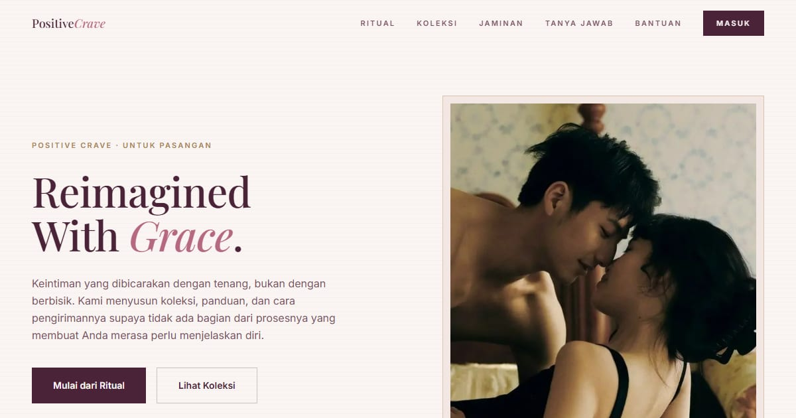

# Positive Crave — Konsep Grace

Landing page Positive Crave konsep "Grace": keintiman yang anggun — sensualitas dengan sofistikasi yang halus.

**Demo live:** https://crave-grace.vercel.app



> Konsep desain untuk kontes brief Positive Crave, bukan toko resmi. Checkout dan login hanya purwarupa.

## Konsep

Konsep "Grace" dengan bahasa rupa **Amplop Sutra**, satu-satunya varian terang di brief ini: kertas gading, Playfair italic, garis rambut tipis, dan plum tua sebagai pengganti hitam.

## Halaman

`/` · `/checkout` · `/forgot` · `/masuk` · `/produk` · `/register`

## Teknologi

- Next.js 15.5 (App Router) dan React 19
- Tailwind CSS v4
- JavaScript
- Framer Motion, Lucide (ikon)
- Font: Playfair Display, Inter (next/font)
- SEO: metadata per halaman, Open Graph, JSON-LD, sitemap.xml, dan robots.txt

## Menjalankan secara lokal

```bash
npm install
npm run dev
```

Buka http://localhost:3000. Untuk build produksi: `npm run build` lalu `npm start`.

## Kredit foto

Foto hero berlisensi **CC0 (domain publik)**: bebas dipakai, termasuk untuk komersial, tanpa wajib atribusi. Asalnya tetap dicatat di sini supaya jelas.

- `public/images/hero.webp` — "Engagement Ring" oleh Matt Bango, StockSnap, CC0 ([sumber](https://stocksnap.io/photo/engagement-ring-6OBGTOXRDW)). Dipotong ke 4:5.
- `public/images/minyak-pijat.webp` — ilustrasi buatan sendiri untuk purwarupa ini.
- Foto produk lainnya (`p2`–`p8`, `p14`) belum terverifikasi asal-usulnya. Ganti dengan foto produk asli klien sebelum situs dipakai sungguhan.

---

Bagian dari koleksi 9 entri kontes desain web di [PortalKontes](https://portal-kontes.vercel.app). Dibuat oleh [PintuWeb](https://pintuweb.com), jasa pembuatan website.
